# Superego MCP Architecture Documentation

**Version:** 1.0  
**Date:** 2025-08-15  
**Status:** Current Architecture Analysis

## Table of Contents

1. [Executive Summary](#executive-summary)
2. [High-Level System Architecture](#high-level-system-architecture)
3. [Component Architecture](#component-architecture)
4. [Data Flow Diagrams](#data-flow-diagrams)
5. [Inference Provider Architecture](#inference-provider-architecture)
6. [Security Evaluation Flow](#security-evaluation-flow)
7. [Configuration and Dependency Management](#configuration-and-dependency-management)
8. [Current Architectural Issues](#current-architectural-issues)
9. [Recommendations](#recommendations)

## Executive Summary

Superego MCP is a security-focused Model Context Protocol (MCP) server that provides intelligent tool request interception for AI agents. The system operates in two primary modes:

1. **CLI Evaluation Mode** (`superego advise`) - A lightweight, standalone security evaluator for Claude Code hooks
2. **MCP Server Mode** (`superego mcp`) - A full-featured MCP server with rule management and advanced features

The architecture follows a layered approach with Domain, Infrastructure, and Presentation layers, but currently suffers from several architectural issues including global state management, complex initialization patterns, and tight coupling between components.

## High-Level System Architecture

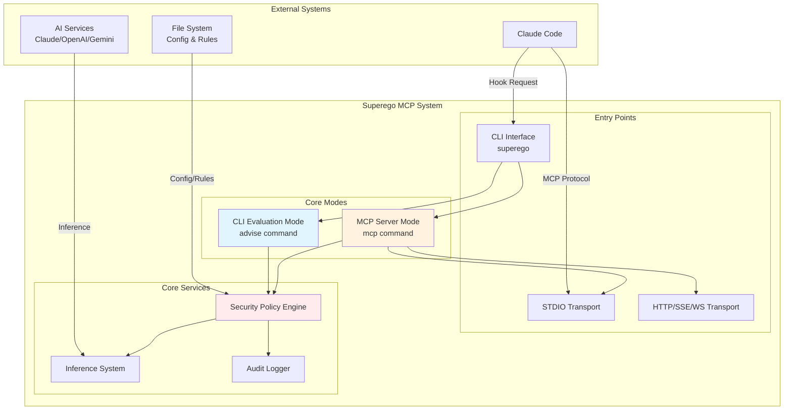

## Component Architecture

### Layer Separation

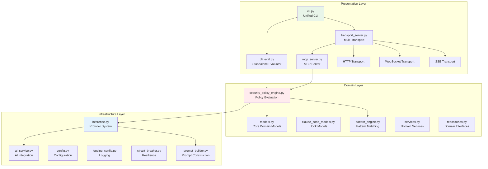

### Dependency Flow (Current State)

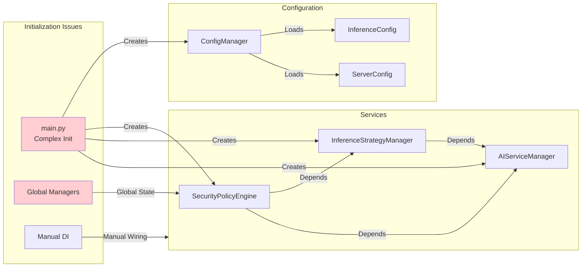

## Data Flow Diagrams

### CLI Evaluation Flow

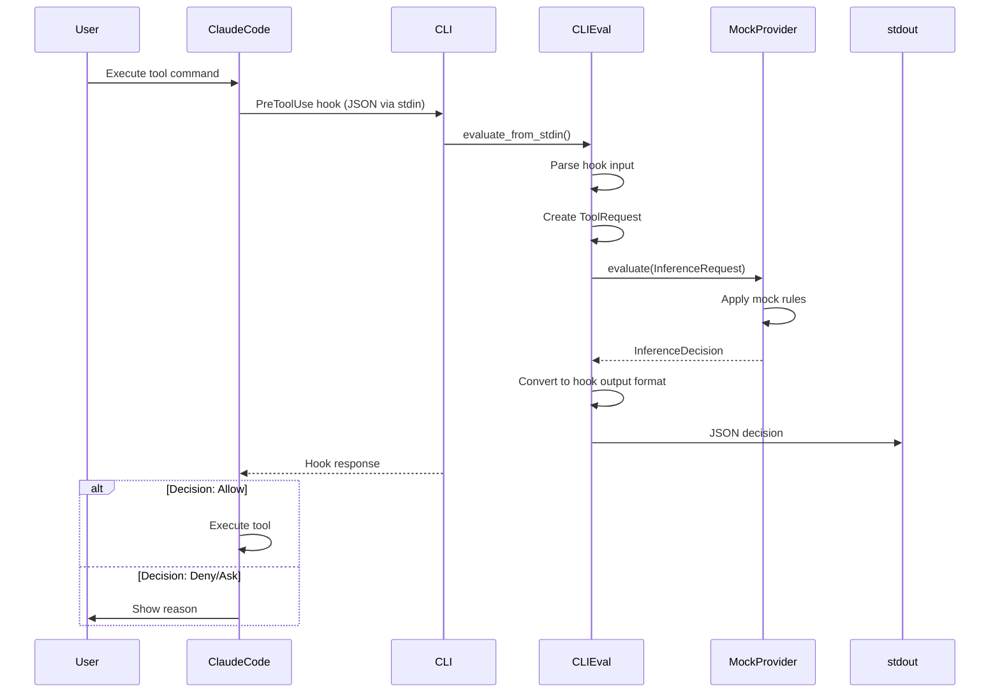

### MCP Server Request Flow

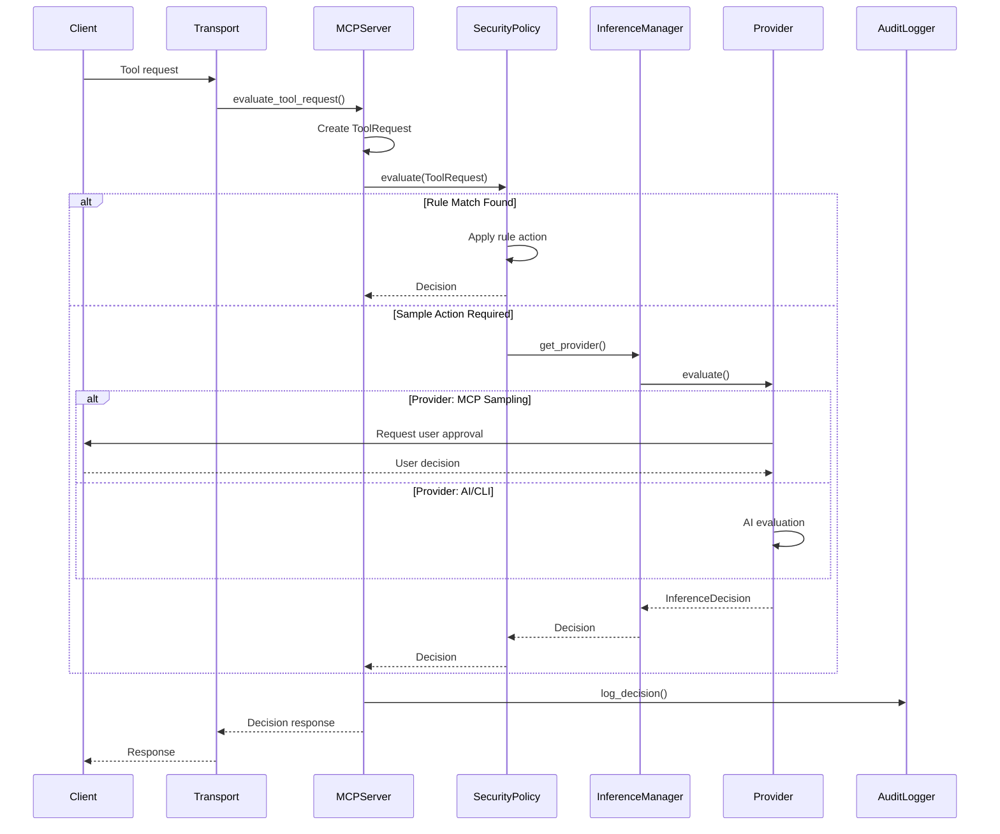

### Configuration Loading Flow

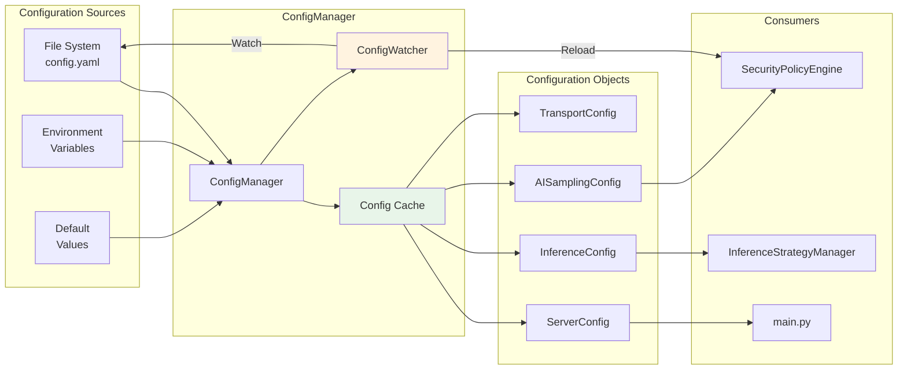

## Inference Provider Architecture

### Provider Hierarchy

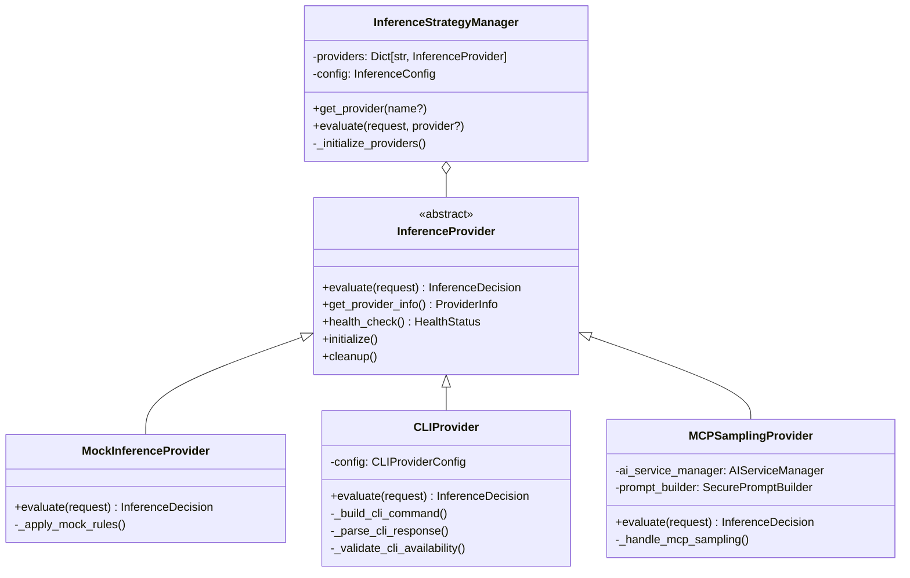

### Provider Selection Strategy

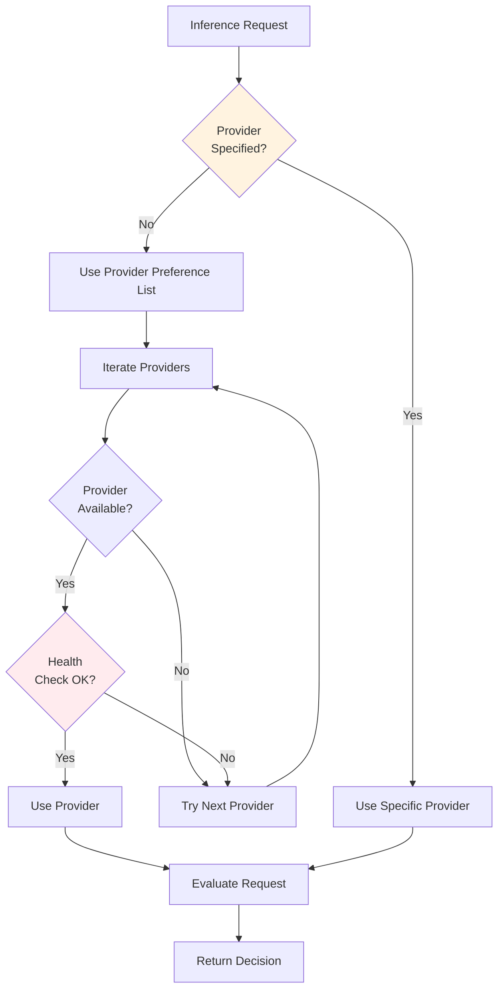

## Security Evaluation Flow

### Rule Matching and Decision Flow

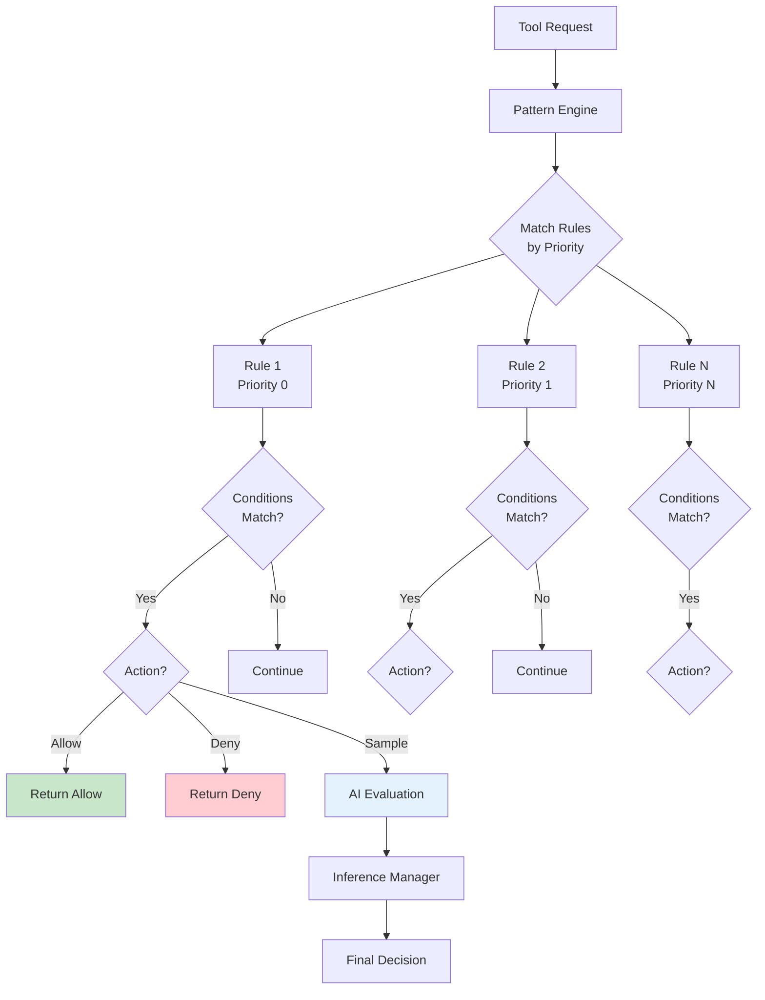

### Pattern Matching Engine

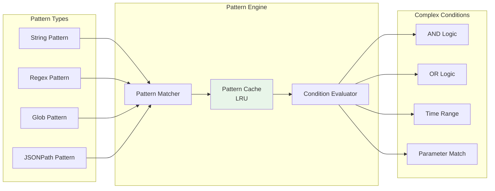

## Configuration and Dependency Management

### Current Issues - Global State

```mermaid
flowchart TD
    subgraph "Global State Problem"
        MCP[mcp_server.py]
        GLOBALS[Global Variables<br/>Lines 19-24]
        
        MCP --> GLOBALS
        
        GLOBALS --> G1[global security_policy]
        GLOBALS --> G2[global audit_logger]
        GLOBALS --> G3[global error_handler]
        GLOBALS --> G4[global health_monitor]
    end
    
    subgraph "Initialization Complexity"
        MAIN[main.py<br/>async_main()]
        INIT[Lines 35-209<br/>Complex Init]
        
        MAIN --> INIT
        
        INIT --> C1[Load Config]
        INIT --> C2[Create Components]
        INIT --> C3[Wire Dependencies]
        INIT --> C4[Start Services]
    end
    
    subgraph "Manual DI Pattern"
        DEP[dependencies dict]
        
        DEP --> D1[ai_service_manager]
        DEP --> D2[prompt_builder]
        
        D1 --> ISM[InferenceStrategyManager]
        D2 --> ISM
    end
    
    style GLOBALS fill:#ffcdd2
    style INIT fill:#ffcdd2
```

### Proposed DI Architecture

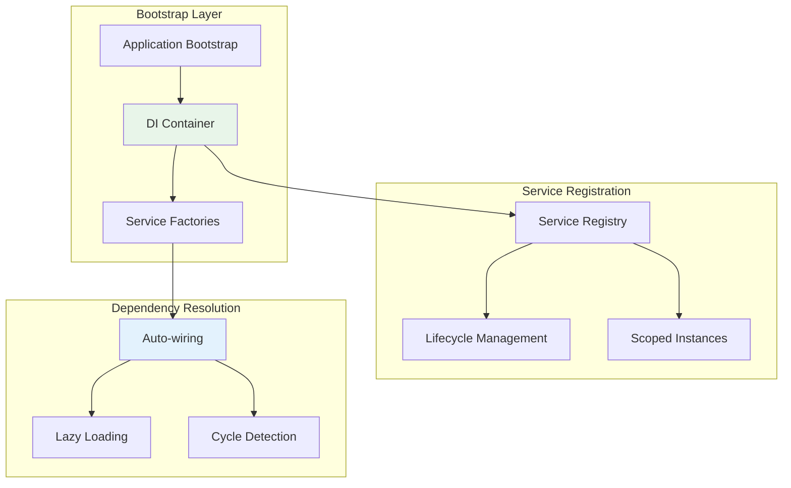

## Current Architectural Issues

### 1. Global State Management

The system currently uses global variables for dependency injection in the MCP server, making it difficult to test and creating tight coupling between components.

**Impact:**
- Testing requires mocking global state
- Multiple server instances not possible
- Difficult to reason about dependencies

### 2. Complex Initialization

The main.py file contains a 170+ line initialization function that mixes concerns:
- Configuration loading
- Component creation
- Dependency wiring
- Service startup

**Impact:**
- Hard to test individual components
- Difficult to modify initialization order
- Error handling is complex and scattered

### 3. Inference System Complexity

The inference system has evolved to support multiple providers but maintains backward compatibility through complex wrapper patterns:
- Legacy AIServiceManager wrapped by MCPSamplingProvider
- Duplicate configuration classes
- Complex provider initialization logic

**Impact:**
- Maintenance burden
- Potential for configuration drift
- Performance overhead from wrapper layers

### 4. Configuration Management

Configuration is scattered across multiple locations:
- CLIProviderConfig defined in multiple files
- Environment variable handling mixed with file loading
- No clear configuration validation layer

**Impact:**
- Configuration errors discovered at runtime
- Difficult to understand all configuration options
- Potential security issues from unvalidated input

### 5. Error Handling Patterns

Error handling is inconsistent across layers:
- Domain layer uses custom exceptions
- Infrastructure uses various error types
- Presentation layer has transport-specific errors

**Impact:**
- Difficult to handle errors consistently
- User-facing error messages may leak implementation details
- Error recovery strategies are ad-hoc

## Recommendations

### 1. Implement Proper Dependency Injection

Create a dedicated bootstrap package with a DI container:
```
src/superego_mcp/bootstrap/
├── container.py      # DI container implementation
├── factories.py      # Service factories
└── application.py    # Application bootstrap
```

### 2. Refactor Main Initialization

Break down the complex initialization into focused components:
- ConfigurationLoader: Handle all config loading
- ServiceBuilder: Create and wire services
- ApplicationRunner: Manage lifecycle

### 3. Simplify Inference Architecture

Create a clean provider abstraction without legacy wrappers:
- Define clear provider interface
- Implement providers directly
- Use factory pattern for provider creation

### 4. Consolidate Configuration

Create a single source of truth for configuration:
- Define all config models in one place
- Implement configuration validation
- Use configuration schemas

### 5. Standardize Error Handling

Implement a consistent error handling strategy:
- Define error hierarchy
- Create error transformation layer
- Implement user-friendly error messages

### 6. Performance Optimizations

Address performance bottlenecks:
- Implement proper caching strategies
- Use async I/O consistently
- Optimize pattern matching with better algorithms

### 7. Testing Infrastructure

Improve testability:
- Remove global state dependencies
- Create test fixtures for common scenarios
- Implement integration test harness

## Conclusion

Superego MCP demonstrates good architectural principles but has accumulated technical debt through rapid development. The primary issues revolve around dependency management, configuration handling, and the evolution of the inference system. By addressing these issues systematically, the codebase can become more maintainable, testable, and performant while maintaining its security-first focus.

The recommended refactoring plan prioritizes high-impact changes that will improve the developer experience and system reliability without requiring a complete rewrite. The modular architecture already in place provides a solid foundation for these improvements.