# Superego MCP - Detailed Data Flow Diagrams

## Table of Contents

1. [CLI Hook Integration Flow](#cli-hook-integration-flow)
2. [MCP Server Startup Flow](#mcp-server-startup-flow)
3. [Security Policy Evaluation Flow](#security-policy-evaluation-flow)
4. [Inference Provider Selection Flow](#inference-provider-selection-flow)
5. [Error Handling and Recovery Flow](#error-handling-and-recovery-flow)
6. [Configuration Hot Reload Flow](#configuration-hot-reload-flow)
7. [Audit Logging Flow](#audit-logging-flow)

## CLI Hook Integration Flow

### Complete CLI Evaluation Lifecycle

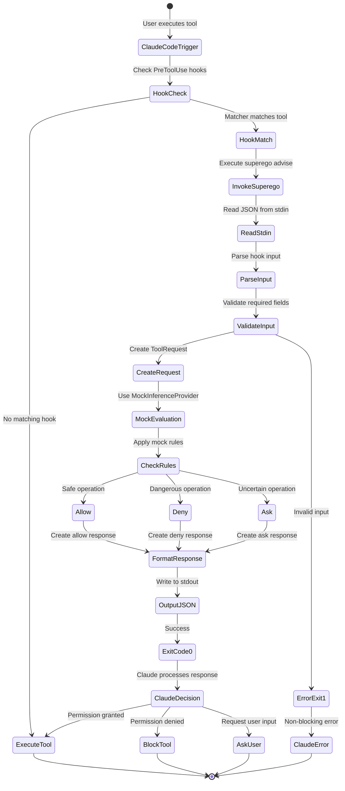

### Hook Input/Output Format

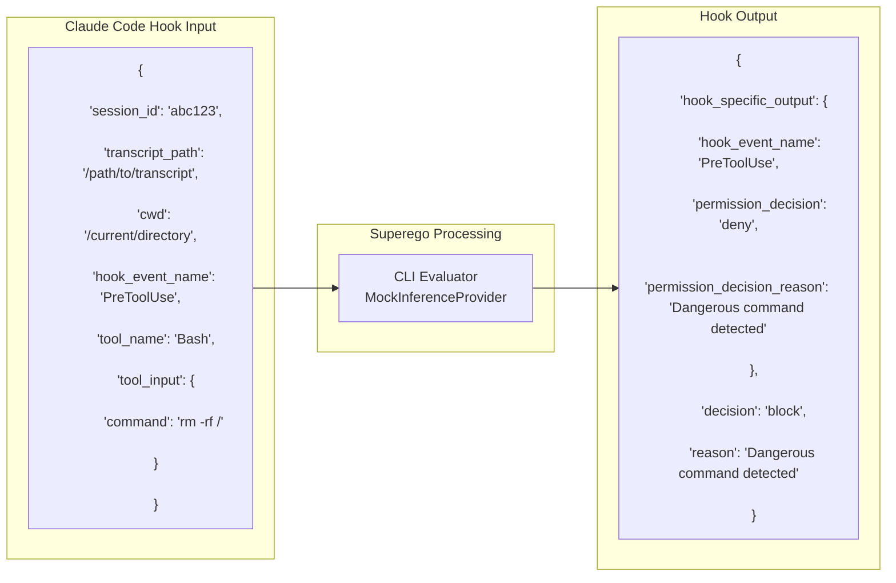

## MCP Server Startup Flow

### Initialization Sequence

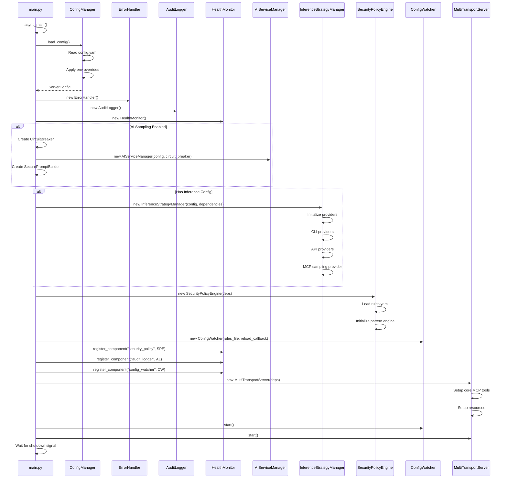

### Component Dependencies

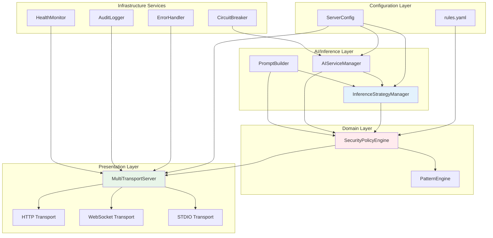

## Security Policy Evaluation Flow

### Complete Evaluation Process

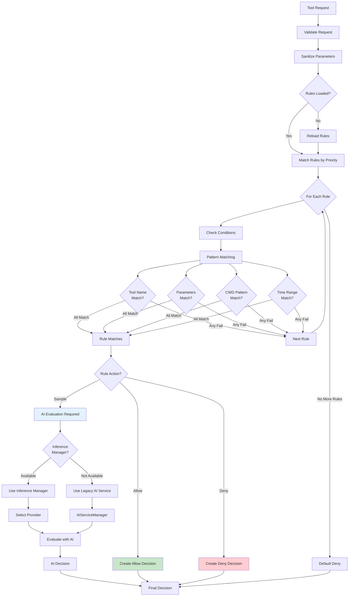

### Pattern Engine Detail

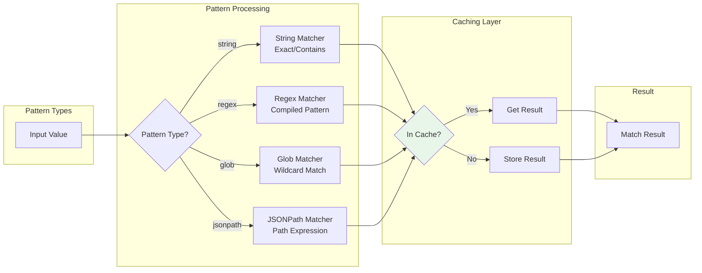

## Inference Provider Selection Flow

### Provider Strategy

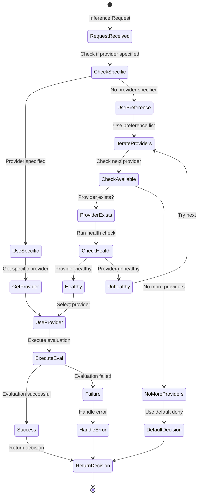

### Provider Types and Capabilities

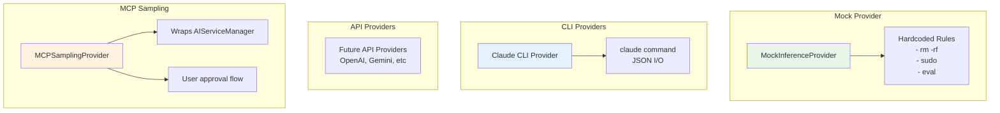

## Error Handling and Recovery Flow

### Error Propagation

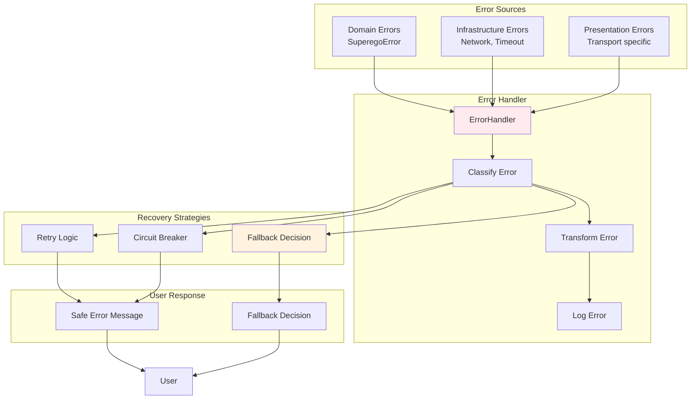

### Circuit Breaker States

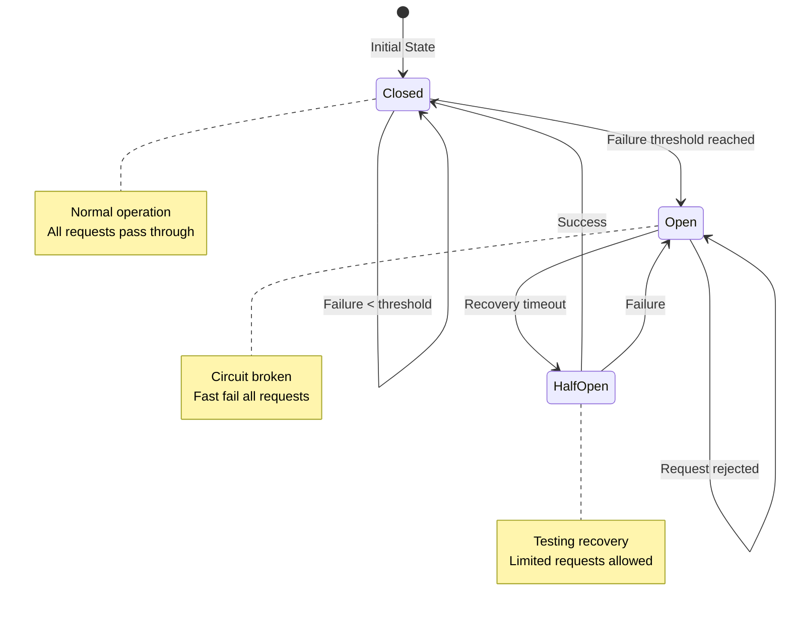

## Configuration Hot Reload Flow

### File Watcher Mechanism

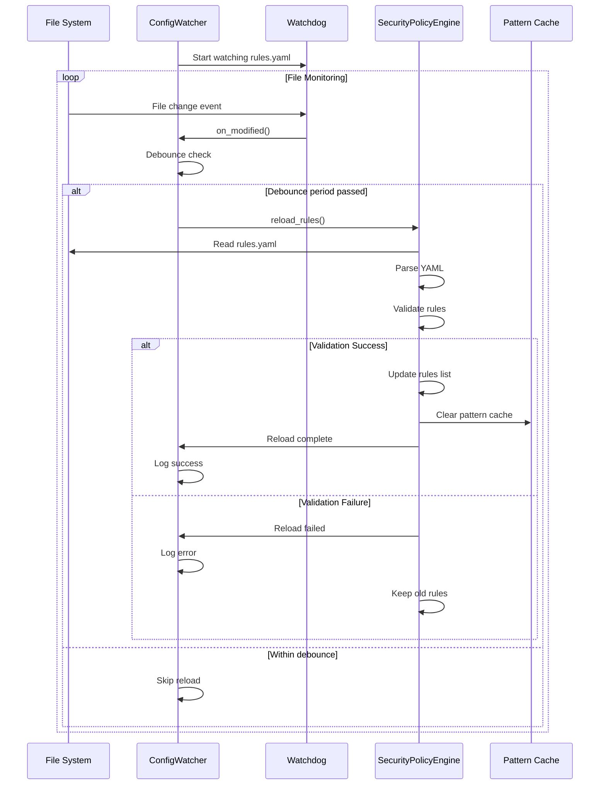

### Configuration Cascade

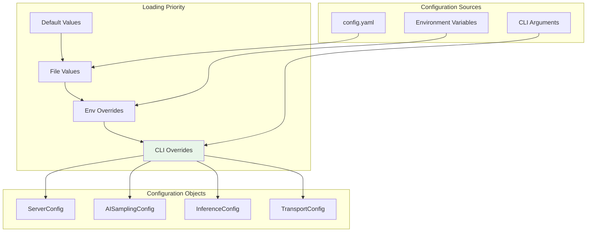

## Audit Logging Flow

### Audit Entry Creation

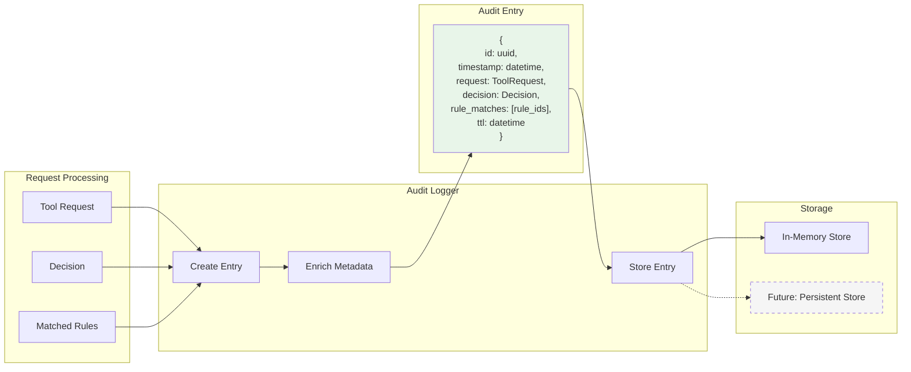

### Audit Query Flow

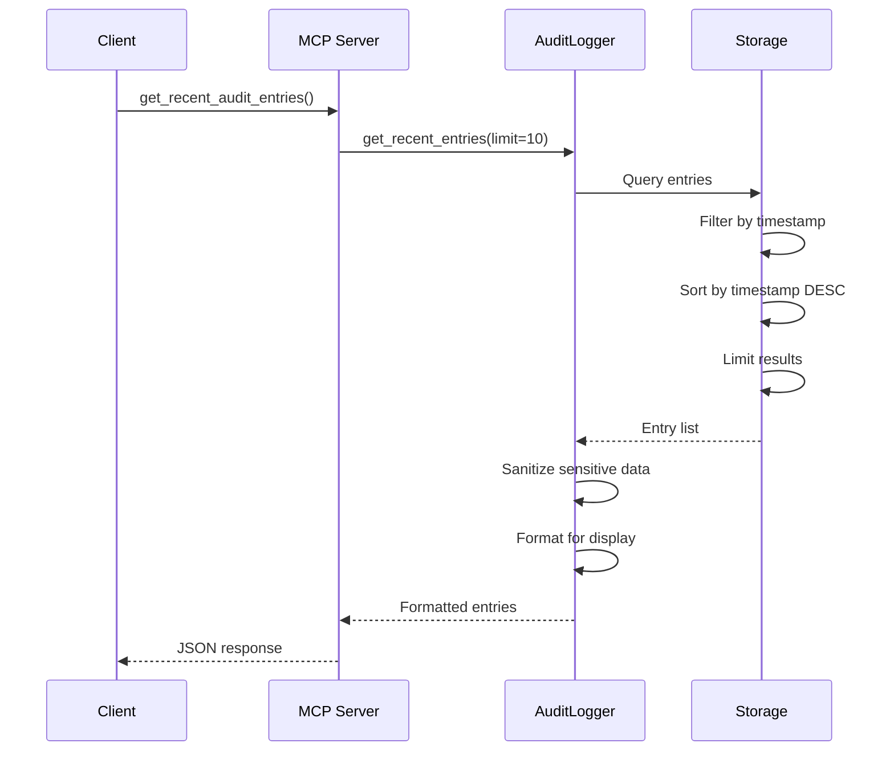

## Summary

These data flow diagrams illustrate the complex interactions within the Superego MCP system. Key observations:

1. **Dual Mode Operation**: The system elegantly handles both CLI evaluation (lightweight) and full MCP server modes
2. **Layered Error Handling**: Errors are transformed and handled appropriately at each layer
3. **Flexible Provider System**: The inference architecture supports multiple provider types with fallback strategies
4. **Hot Reload Capability**: Configuration changes can be applied without server restart
5. **Comprehensive Audit Trail**: All security decisions are logged for compliance and debugging

The architecture demonstrates good separation of concerns but would benefit from dependency injection to reduce coupling and improve testability.