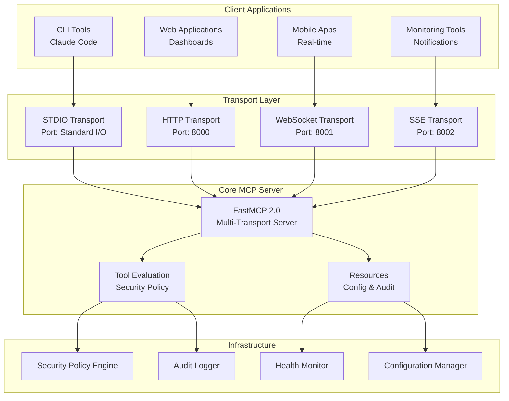

# Multi-Transport Implementation Guide

## Overview

The Superego MCP Server now supports multiple transport protocols, allowing clients to interact with the security evaluation engine through different communication channels based on their specific needs.

## Supported Transports

### 1. STDIO Transport (Default)
- **Use Case**: Command-line integration, Claude Code, and other CLI-based AI tools
- **Protocol**: Standard Input/Output
- **Configuration**: Always enabled, no additional configuration required
- **Features**: Synchronous tool evaluation, resource access, and audit logging

### 2. HTTP REST API
- **Use Case**: Web applications, API integrations, external monitoring tools
- **Protocol**: HTTP/HTTPS with JSON payloads
- **Port**: Default 8000 (configurable)
- **Features**: RESTful endpoints, OpenAPI documentation, CORS support

#### HTTP Endpoints

```yaml
# Core Evaluation
POST /v1/evaluate          # Evaluate tool requests
GET /v1/health            # Health check
GET /v1/server-info       # Server information

# Configuration Management
GET /v1/config/rules      # Current security rules
GET /v1/audit/recent      # Recent audit entries
GET /v1/metrics           # Performance metrics

# Documentation
GET /docs                 # OpenAPI (Swagger) documentation
GET /redoc                # ReDoc documentation
```

### 3. WebSocket Transport
- **Use Case**: Real-time applications, interactive dashboards, live monitoring
- **Protocol**: WebSocket (RFC 6455)
- **Port**: Default 8001 (configurable)
- **Features**: Bidirectional communication, event subscriptions, connection lifecycle management

#### WebSocket Message Types

```json
// Tool Evaluation
{
  "message_id": "eval-001",
  "type": "evaluate",
  "data": {
    "tool_name": "example_tool",
    "parameters": {"arg": "value"},
    "agent_id": "agent_1",
    "session_id": "session_1",
    "cwd": "/tmp"
  }
}

// Health Check
{
  "message_id": "health-001",
  "type": "health",
  "data": {}
}

// Event Subscription
{
  "message_id": "sub-001",
  "type": "subscribe",
  "data": {
    "subscription_type": "audit"  // "health", "audit", "config"
  }
}

// Ping/Pong
{
  "message_id": "ping-001",
  "type": "ping",
  "data": {}
}
```

### 4. Server-Sent Events (SSE)
- **Use Case**: Live dashboards, configuration monitoring, real-time notifications
- **Protocol**: Server-Sent Events over HTTP
- **Port**: Default 8002 (configurable)  
- **Features**: Unidirectional streaming, automatic reconnection, event filtering

#### SSE Endpoints

```yaml
GET /v1/events/config     # Configuration change events
GET /v1/events/health     # Health status events  
GET /v1/events/audit      # Audit entry events
GET /v1/events            # All events (combined stream)
```

## Configuration

### Server Configuration (`config/server.yaml`)

```yaml
# Multi-Transport Configuration
transport:
  stdio:
    enabled: true    # Always enabled
    
  http:
    enabled: true
    host: "0.0.0.0"
    port: 8000
    cors_origins: ["*"]
    
  websocket:
    enabled: true
    host: "0.0.0.0"
    port: 8001
    cors_origins: ["*"]
    ping_interval: 20
    ping_timeout: 30
    
  sse:
    enabled: true
    host: "0.0.0.0"
    port: 8002
    cors_origins: ["*"]
    keepalive_interval: 30
```

### Environment Variables

```bash
# Override transport settings
SUPEREGO_TRANSPORT__HTTP__ENABLED=true
SUPEREGO_TRANSPORT__HTTP__PORT=9000
SUPEREGO_TRANSPORT__WEBSOCKET__ENABLED=false
```

## Running the Server

### Start with All Transports

```bash
# Using the main entry point
python -m superego_mcp.main

# Or using uv
uv run python -m superego_mcp.main
```

### Enable Specific Transports

```bash
# Only HTTP and WebSocket (modify config/server.yaml)
transport:
  http:
    enabled: true
  websocket:
    enabled: true
  sse:
    enabled: false
```

## Client Examples

### HTTP Client (Python)

```python
import asyncio
import httpx

async def evaluate_tool():
    async with httpx.AsyncClient() as client:
        response = await client.post(
            "http://localhost:8000/v1/evaluate",
            json={
                "tool_name": "example_tool",
                "parameters": {"action": "read", "file": "test.txt"},
                "agent_id": "demo_agent",
                "session_id": "demo_session",
                "cwd": "/tmp"
            }
        )
        return response.json()

result = asyncio.run(evaluate_tool())
print(result)
```

### WebSocket Client (Python)

```python
import asyncio
import json
import websockets

async def websocket_client():
    uri = "ws://localhost:8001/v1/ws"
    async with websockets.connect(uri) as websocket:
        # Send evaluation request
        message = {
            "message_id": "eval-001",
            "type": "evaluate", 
            "data": {
                "tool_name": "example_tool",
                "parameters": {"test": True},
                "agent_id": "ws_agent",
                "session_id": "ws_session",
                "cwd": "/tmp"
            }
        }
        
        await websocket.send(json.dumps(message))
        response = await websocket.recv()
        return json.loads(response)

result = asyncio.run(websocket_client())
print(result)
```

### SSE Client (Python)

```python
import asyncio
import httpx

async def sse_client():
    async with httpx.AsyncClient() as client:
        async with client.stream("GET", "http://localhost:8002/v1/events/health") as response:
            async for chunk in response.aiter_text():
                if chunk.strip():
                    print(f"Event: {chunk}")

asyncio.run(sse_client())
```

### JavaScript/Browser Client

```javascript
// HTTP API
const response = await fetch('http://localhost:8000/v1/evaluate', {
  method: 'POST',
  headers: {
    'Content-Type': 'application/json',
  },
  body: JSON.stringify({
    tool_name: 'example_tool',
    parameters: { action: 'read', file: 'test.txt' },
    agent_id: 'web_agent',
    session_id: 'web_session',
    cwd: '/tmp'
  })
});
const result = await response.json();

// WebSocket
const ws = new WebSocket('ws://localhost:8001/v1/ws');
ws.onopen = () => {
  ws.send(JSON.stringify({
    message_id: 'eval-001',
    type: 'evaluate',
    data: {
      tool_name: 'example_tool',
      parameters: { web: true },
      agent_id: 'web_ws_agent',
      session_id: 'web_session',
      cwd: '/tmp'
    }
  }));
};
ws.onmessage = (event) => {
  const response = JSON.parse(event.data);
  console.log('WebSocket response:', response);
};

// Server-Sent Events
const eventSource = new EventSource('http://localhost:8002/v1/events/health');
eventSource.onmessage = (event) => {
  console.log('SSE event:', event.data);
};
```

## Architecture

### Multi-Transport Server Architecture



### Transport Characteristics

| Transport | Latency | Scalability | Complexity | Use Case |
|-----------|---------|-------------|------------|----------|
| STDIO | Low | Single Client | Low | CLI/Desktop Tools |
| HTTP | Medium | High | Low | Web APIs, Integration |
| WebSocket | Low | Medium | Medium | Real-time Apps |
| SSE | Medium | High | Low | Live Dashboards |

## Security Considerations

### CORS Configuration
- HTTP and WebSocket transports support configurable CORS origins
- Default configuration allows all origins (`["*"]`)
- Production deployments should specify allowed origins explicitly

### Authentication
- All transports use the same security evaluation engine
- Transport-level authentication can be added via reverse proxy (Nginx, Traefik)
- Future enhancement: Built-in JWT/OAuth support per transport

### Rate Limiting
- Global rate limiting applies to all transports
- Individual transport rate limiting can be implemented via middleware
- WebSocket connections have built-in ping/pong heartbeat

## Monitoring and Observability

### Health Checks
- HTTP: `GET /v1/health`
- WebSocket: `{"type": "health"}` message
- SSE: `/v1/events/health` stream
- All transports report consistent health status

### Metrics Collection
- Request counts per transport
- Response times by transport type  
- Error rates and failure modes
- Connection counts (WebSocket/SSE)

### Logging
- Structured logging with transport context
- Audit trail across all transports
- Performance metrics and debugging information

## Performance Tuning

### HTTP Transport
```yaml
# Increase worker processes for high throughput
uvicorn:
  workers: 4
  max_requests: 1000
```

### WebSocket Transport
```yaml
# Adjust connection limits and timeouts
websocket:
  ping_interval: 20
  ping_timeout: 30
  max_connections: 1000
```

### SSE Transport  
```yaml
# Configure keepalive and buffer sizes
sse:
  keepalive_interval: 30
  buffer_size: 8192
```

## Testing

### Running the Demo

```bash
# Install demo dependencies
uv add --group demo websockets

# Run multi-transport demo
uv run python demo/multi_transport_demo.py
```

### Unit Tests

```bash
# Run transport-specific tests
uv run pytest tests/test_multi_transport.py -v

# Run integration tests
uv run pytest tests/test_multi_transport_integration.py -v
```

### Manual Testing

```bash
# Test HTTP API
curl -X POST http://localhost:8000/v1/evaluate \
  -H "Content-Type: application/json" \
  -d '{"tool_name": "test_tool", "parameters": {}, "agent_id": "test", "session_id": "test", "cwd": "/tmp"}'

# Test WebSocket (using websocat)
echo '{"message_id": "test", "type": "ping", "data": {}}' | websocat ws://localhost:8001/v1/ws

# Test SSE
curl -N http://localhost:8002/v1/events/health
```

## Troubleshooting

### Common Issues

1. **Port Already in Use**
   - Change ports in `config/server.yaml`
   - Check for conflicting services: `lsof -i :8000`

2. **CORS Errors**
   - Update `cors_origins` in transport configuration
   - Use specific origins instead of `["*"]` in production

3. **WebSocket Connection Drops**
   - Check firewall settings
   - Adjust `ping_interval` and `ping_timeout`
   - Verify proxy configuration for WebSocket upgrade

4. **SSE Stream Interruption**
   - Disable proxy buffering: `X-Accel-Buffering: no`
   - Increase client timeout settings
   - Check network connectivity

### Debug Mode

```bash
# Enable debug logging
export SUPEREGO_DEBUG=true
export SUPEREGO_LOG_LEVEL=DEBUG

# Run server
uv run python -m superego_mcp.main
```

## Future Enhancements

### Planned Features
- [ ] Transport-specific authentication and authorization
- [ ] Rate limiting per transport type
- [ ] Metrics dashboard with transport breakdown
- [ ] gRPC transport for high-performance scenarios
- [ ] Message queuing for async tool evaluation
- [ ] Transport-specific middleware and plugins

### Integration Opportunities  
- [ ] Prometheus metrics export
- [ ] OpenTelemetry tracing across transports
- [ ] Kubernetes health checks and service mesh
- [ ] API Gateway integration (Kong, Ambassador)
- [ ] Load balancing strategies per transport type

---

For more detailed implementation information, see:
- [API Documentation](./api-documentation.md)
- [Security Guide](./security-guide.md)  
- [Deployment Guide](./deployment-guide.md)