# Superego MCP - Security Architecture Documentation

## Table of Contents

1. [Security Model Overview](#security-model-overview)
2. [Threat Model](#threat-model)
3. [Security Components](#security-components)
4. [Defense in Depth](#defense-in-depth)
5. [Security Decision Flow](#security-decision-flow)
6. [Input Sanitization](#input-sanitization)
7. [AI Prompt Security](#ai-prompt-security)
8. [Audit and Compliance](#audit-and-compliance)

## Security Model Overview

Superego MCP implements a multi-layered security model designed to protect against malicious tool usage by AI agents. The system operates on a "default deny" principle with explicit allow rules.

## Threat Model

### Threat Actors

### Threat Scenarios

## Security Components

### Core Security Architecture

### Security Rule Structure

## Defense in Depth

### Layered Security Model

## Security Decision Flow

### Decision Tree

## Input Sanitization

### Sanitization Pipeline

### Common Attack Pattern Prevention

## AI Prompt Security

### Secure Prompt Construction

### Prompt Injection Prevention

## Audit and Compliance

### Audit Trail Architecture

```mermaid
flowchart TB
    subgraph "Event Sources"
        E1[Tool Requests]
        E2[Security Decisions]
        E3[Rule Matches]
        E4[AI Evaluations]
        E5[User Overrides]
    end
    
    subgraph "Audit Logger"
        LOG[Central Logger]
        ENRICH[Metadata Enrichment]
        SANITIZE[PII Sanitization]
        COMPRESS[Data Compression]
    end
    
    subgraph "Storage"
        MEM[In-Memory Buffer]
        PERSIST[Persistent Storage]
        ARCHIVE[Long-term Archive]
    end
    
    subgraph "Analysis"
        QUERY[Query Interface]
        REPORT[Report Generation]
        ALERT[Security Alerts]
    end
    
    E1 --> LOG
    E2 --> LOG
    E3 --> LOG
    E4 --> LOG
    E5 --> LOG
    
    LOG --> ENRICH
    ENRICH --> SANITIZE
    SANITIZE --> COMPRESS
    
    COMPRESS --> MEM
    MEM --> PERSIST
    PERSIST --> ARCHIVE
    
    PERSIST --> QUERY
    QUERY --> REPORT
    QUERY --> ALERT
    
    style LOG fill:#e3f2fd
    style SANITIZE fill:#ffebee
```

### Compliance Requirements

### Security Metrics

## Summary

The Superego MCP security architecture implements comprehensive protection through:

1. **Multi-layered Defense**: Each layer provides independent security controls
2. **Default Deny Principle**: All requests are denied unless explicitly allowed
3. **Pattern-based Detection**: Fast identification of known attack patterns
4. **AI-powered Analysis**: Semantic understanding of complex threats
5. **Comprehensive Auditing**: Full trail for compliance and investigation
6. **Input Sanitization**: Protection against injection attacks
7. **Secure AI Integration**: Protected against prompt manipulation

The architecture is designed to be extensible, allowing new security rules and patterns to be added without code changes, while maintaining high performance through caching and optimized pattern matching.