# Superego MCP - Complete System Overview

## Executive Summary

Superego MCP is a sophisticated security-focused Model Context Protocol (MCP) server that provides intelligent tool request interception for AI agents. This document provides a complete overview of the system architecture, component interactions, and operational flows.

## System Architecture Overview

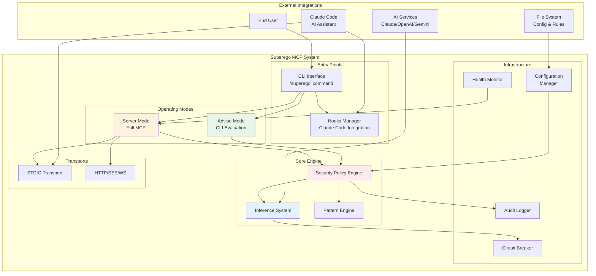

## Component Interaction Map

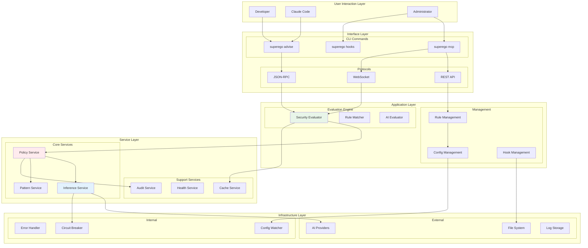

## Operational Flows

### 1. Tool Request Evaluation Flow

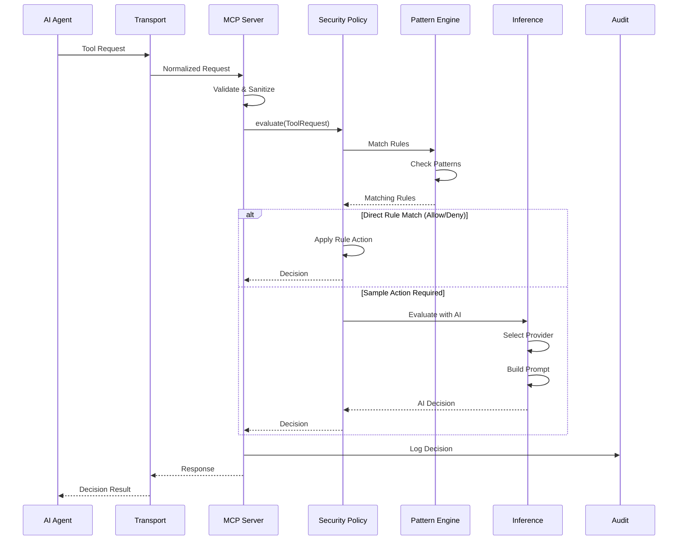

### 2. Configuration and Rule Management

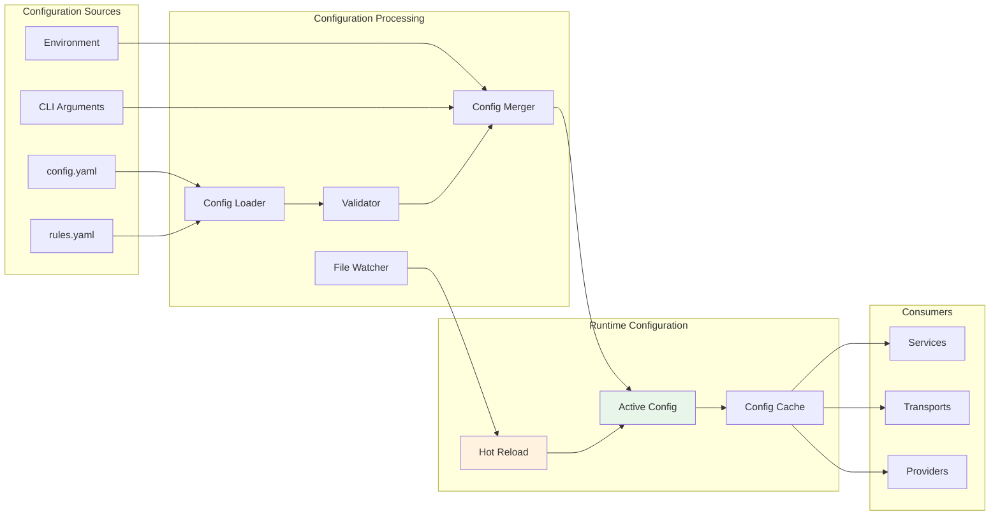

### 3. Multi-Mode Operation

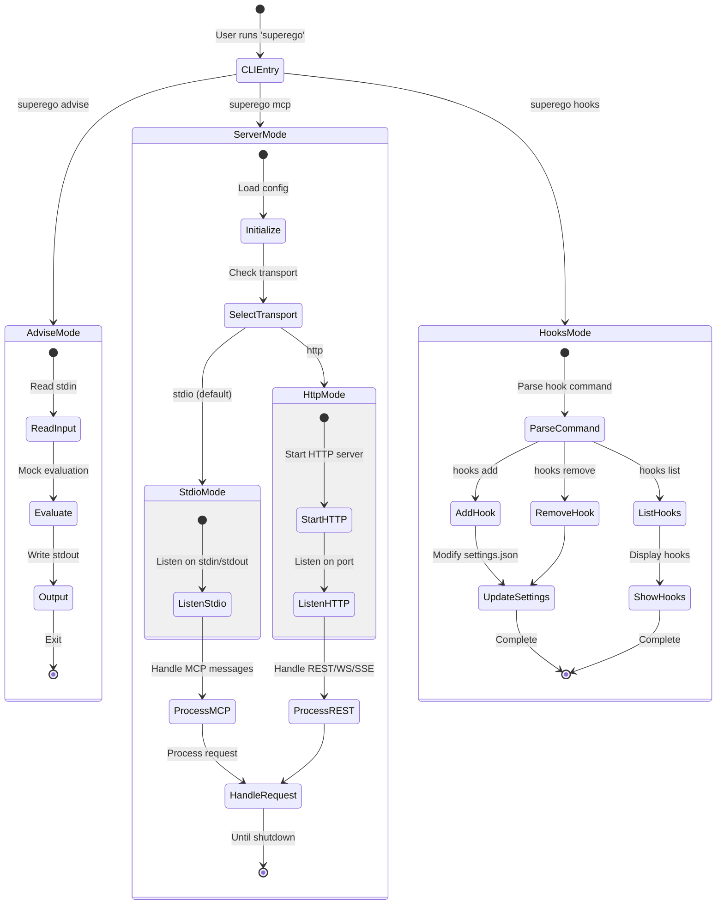

## Key Design Patterns

### 1. Layered Architecture

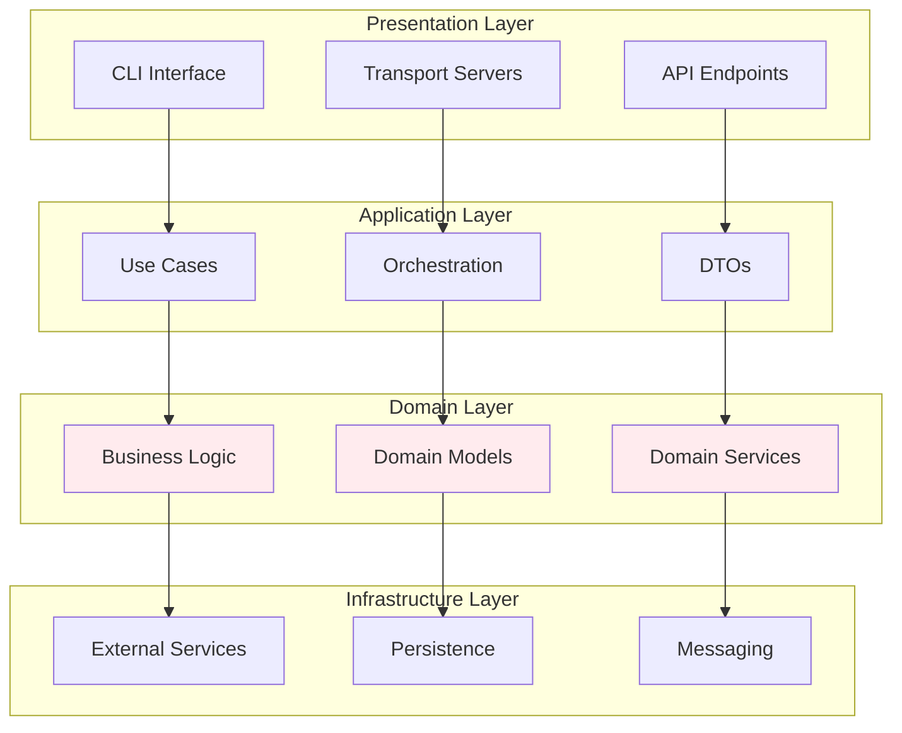

### 2. Provider Strategy Pattern

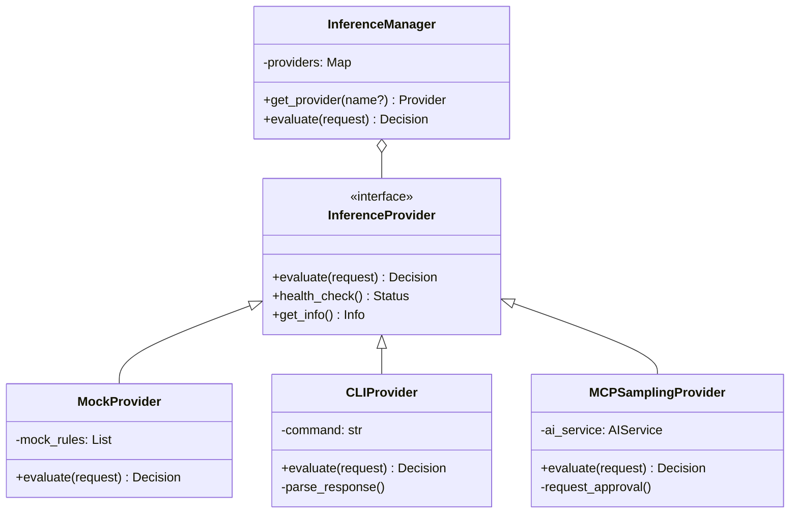

### 3. Circuit Breaker Pattern

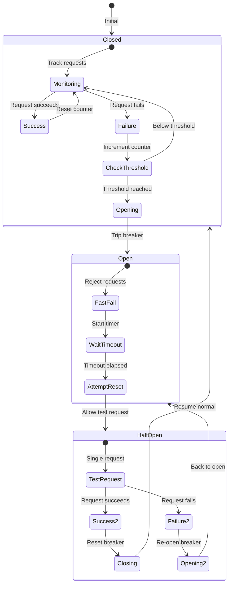

## Performance Characteristics

### Request Processing Pipeline

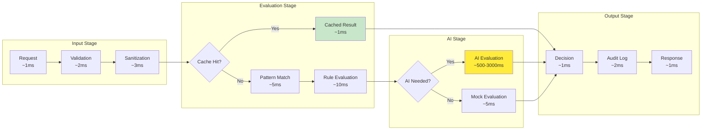

### Scalability Considerations

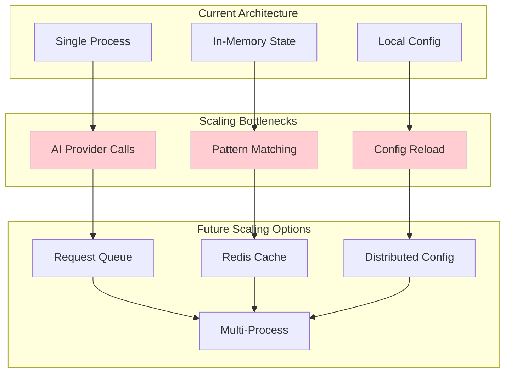

## Deployment Architecture

### Local Development Setup

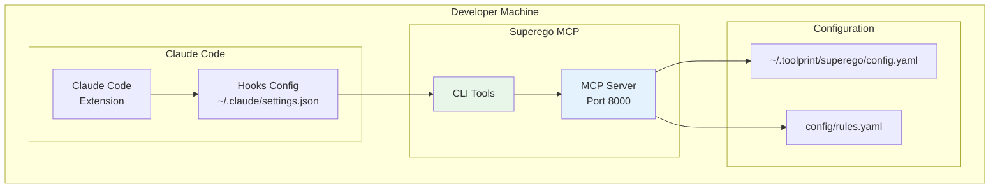

### Production Deployment Options

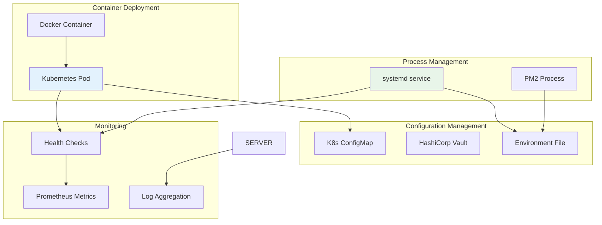

## Summary

Superego MCP is a well-architected security system with:

### Strengths
- **Clear separation of concerns** between layers
- **Flexible provider system** for AI evaluation
- **Comprehensive security model** with defense in depth
- **Hot reload capability** for configuration changes
- **Multiple transport options** for different use cases
- **Extensive audit trail** for compliance

### Current Limitations
- **Global state management** makes testing difficult
- **Complex initialization** in main.py
- **Tight coupling** between some components
- **Limited horizontal scaling** options
- **In-memory storage** only

### Future Opportunities
- **Dependency injection** framework
- **Distributed deployment** support
- **Persistent storage** options
- **Enhanced monitoring** and metrics
- **Plugin architecture** for extensions
- **API gateway** integration

The architecture provides a solid foundation for a security-focused MCP server while maintaining flexibility for future enhancements and scaling requirements.