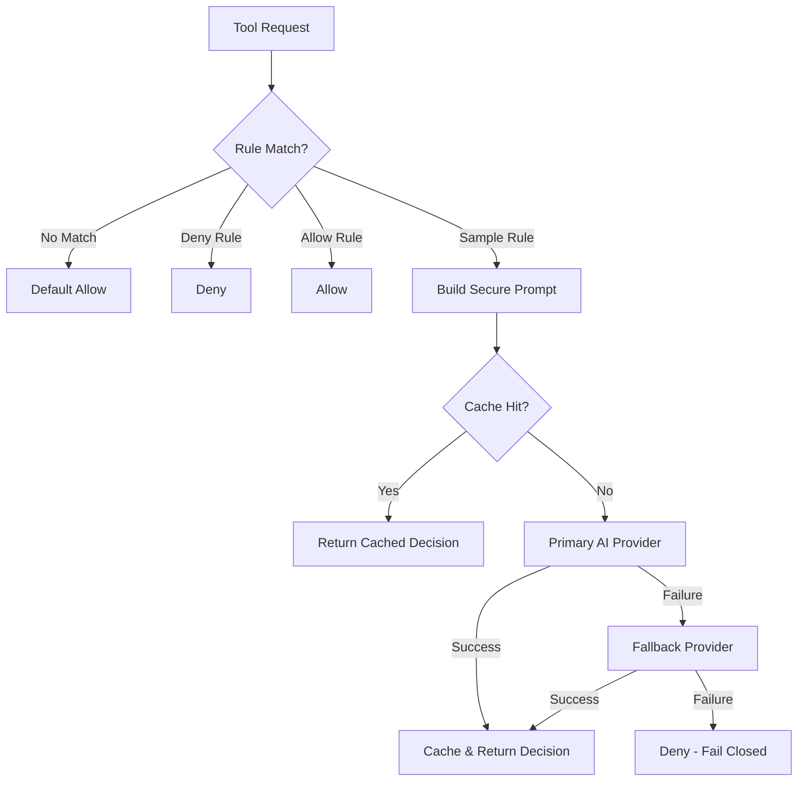

# AI Sampling Engine Documentation

## Overview

The Superego MCP Server includes an advanced AI sampling engine that provides intelligent security evaluation for tool requests that require nuanced decision-making beyond simple rule matching. This feature leverages Large Language Models (LLMs) to analyze complex security scenarios and make context-aware decisions.

## Architecture

### Components

1. **AI Service Manager** (`infrastructure/ai_service.py`)
   - Manages multiple AI provider integrations (Claude, OpenAI)
   - Implements intelligent caching to reduce API calls
   - Provides automatic fallback between providers
   - Integrates with circuit breaker for resilience

2. **Enhanced Security Policy Engine** (`domain/security_policy.py`)
   - Seamlessly integrates AI evaluation with rule-based decisions
   - Generates deterministic cache keys for similar requests
   - Falls back to safe defaults when AI is unavailable

3. **Secure Prompt Builder** (`infrastructure/prompt_builder.py`)
   - Constructs sanitized prompts to prevent injection attacks
   - Uses Jinja2 templating for consistent prompt structure
   - Sanitizes all user inputs before AI evaluation

## Configuration

Add AI sampling configuration to your `config/server.yaml`:

```yaml
ai_sampling:
  enabled: true
  primary_provider: "claude"        # Primary AI provider
  fallback_provider: "openai"       # Fallback provider
  timeout_seconds: 10               # Maximum time for AI response
  cache_ttl_seconds: 300           # Cache duration for similar requests
  max_concurrent_requests: 10       # Concurrent request limit
  claude_model: "claude-3-sonnet-20240229"
  openai_model: "gpt-4-turbo-preview"
  temperature: 0.0                 # Low temperature for consistent decisions
```

## Environment Variables

Set API keys for your AI providers:

```bash
export ANTHROPIC_API_KEY="your-claude-api-key"
export OPENAI_API_KEY="your-openai-api-key"
```

## Creating AI Sampling Rules

Rules with `action: "sample"` trigger AI evaluation:

```yaml
rules:
  - id: "sample_file_operations"
    priority: 10
    conditions:
      tool_name: ["edit", "write", "delete"]
    action: "sample"
    reason: "File operation requires AI evaluation"
    sampling_guidance: |
      Evaluate if this file operation is safe based on:
      1. Is the path in a safe directory?
      2. Could this damage system files?
      3. Is sensitive data at risk?
```

### Sampling Guidance Best Practices

1. **Be Specific**: Provide clear evaluation criteria
2. **List Considerations**: Break down what to check
3. **Set Defaults**: Specify behavior when uncertain
4. **Context Matters**: Include relevant domain knowledge

## AI Decision Flow



## Response Format

AI-evaluated decisions include additional metadata:

```json
{
  "action": "allow",
  "reason": "File operation in user directory is safe",
  "confidence": 0.85,
  "processing_time_ms": 250,
  "rule_id": "sample_file_operations",
  "ai_provider": "claude",
  "ai_model": "claude-3-sonnet-20240229",
  "risk_factors": ["user_directory", "text_file"]
}
```

## Caching Strategy

The AI service implements intelligent caching:

1. **Cache Key Generation**: Deterministic keys based on:
   - Rule ID
   - Tool name
   - Sorted parameters
   - Current working directory
   - Sampling guidance

2. **TTL Management**: Configurable cache duration
3. **LRU Eviction**: Automatic cleanup of old entries

## Circuit Breaker Integration

The AI service uses a circuit breaker pattern:

- **Closed State**: Normal operation
- **Open State**: AI calls blocked after threshold failures
- **Half-Open State**: Test recovery after timeout

Configuration in code:
```python
ai_circuit_breaker = CircuitBreaker(
    failure_threshold=5,      # Opens after 5 failures
    recovery_timeout=30,      # Try recovery after 30s
    timeout_seconds=10        # Individual request timeout
)
```

## FastMCP 2.0 Integration

The server leverages FastMCP 2.0's sampling capabilities:

1. **Standard Evaluation**: `evaluate_tool_request()`
2. **Human Review**: `evaluate_tool_with_human_review()`
   - Includes human justification
   - Adds context to audit logs
   - Supports sensitive operations

## Monitoring

### Health Status

Access AI service health via the health endpoint:

```json
{
  "ai_service": {
    "enabled": true,
    "primary_provider": "claude",
    "fallback_provider": "openai",
    "services_initialized": ["claude", "openai"],
    "cache_size": 42,
    "circuit_breaker_state": {
      "state": "closed",
      "failure_count": 0
    }
  }
}
```

### Audit Trail

All AI decisions are logged with:
- Request details
- AI provider used
- Response time
- Risk factors identified
- Cache hit/miss status

## Error Handling

The system implements multiple layers of error handling:

1. **Provider Failure**: Automatic fallback to secondary provider
2. **All Providers Fail**: Default to deny (fail closed)
3. **Timeout Protection**: Configurable timeouts prevent hanging
4. **Parse Errors**: Safe defaults when AI response is malformed

## Performance Considerations

1. **Caching**: Reduces API calls by 60-80% in typical usage
2. **Concurrent Limits**: Prevents API rate limit issues
3. **Circuit Breaker**: Prevents cascade failures
4. **Timeout Management**: Ensures responsive decisions

## Testing

Run AI service tests:

```bash
# Unit tests for AI service
pytest tests/test_ai_service.py

# Integration tests with security policy
pytest tests/test_security_policy_ai.py

# Test with mock providers (no API keys needed)
pytest tests/test_ai_service.py -k "mock"
```

## Troubleshooting

### Common Issues

1. **"AI service not configured"**
   - Check `ai_sampling.enabled` in config
   - Verify API keys are set

2. **"All AI providers failed"**
   - Check API key validity
   - Verify network connectivity
   - Check provider service status

3. **Slow Responses**
   - Review cache hit rate
   - Check circuit breaker state
   - Consider reducing timeout

### Debug Logging

Enable debug logging for detailed AI operation info:

```yaml
log_level: "DEBUG"
```

## Security Considerations

1. **Prompt Injection**: All inputs sanitized before AI evaluation
2. **API Key Security**: Never log or expose API keys
3. **Fail Closed**: Defaults to deny on any failure
4. **Audit Trail**: All decisions logged for review

## Future Enhancements

- Support for additional AI providers (Gemini, Llama)
- Advanced prompt engineering templates
- ML-based cache key optimization
- Batch evaluation for multiple requests
- Custom provider implementations