# Manual Test Harness - Task Breakdown

**Goal:** Complete implementation of Cyclopts-based test harness for Superego MCP Server with interactive testing, OpenAPI examples, and comprehensive test scenarios

**Goaly Goal ID:** 21

## Task Overview

This document breaks down the manual test harness implementation into 8 discrete, actionable tasks with clear dependencies and completion criteria.

## Task Dependencies

```mermaid
graph TD
    A[🔧 Setup Dependencies] --> B[📝 Test Scenarios]
    A --> C[⚙️ HTTP Client]
    A --> D[🔧 CLI Structure]
    B --> E[⚙️ Basic Commands]
    C --> E
    C --> F[⚙️ Advanced Commands]
    B --> F
    G[📝 OpenAPI Examples]
    H[🔧 Configuration]
```



## Tasks

### Task 1: 🔧 Setup Dependencies and Project Structure
**Goaly Task ID:** 150
**Owner:** backend-architect  
**Status:** Available  
**Dependencies:** None  

**Scope:**
- Add test-harness optional dependencies to pyproject.toml
  - cyclopts>=2.0.0
  - httpx>=0.25.0  
  - rich>=13.0.0
  - pydantic>=2.0.0
  - tomli>=2.0.0
- Create test_harness/ directory structure:
  - commands/
  - scenarios/
  - client/
  - config/
- Ensure all __init__.py files are created

**Completion Criteria:**
- [ ] Dependencies added to pyproject.toml under [project.optional-dependencies.test-harness]
- [ ] Directory structure created with proper __init__.py files
- [ ] `uv sync --extra test-harness` runs successfully

---

### Task 2: 📝 Create Test Scenario JSON Files
**Goaly Task ID:** 151
**Owner:** backend-architect  
**Status:** Blocked  
**Dependencies:** Task 150 (Project structure with scenarios/ directory)  

**Scope:**
- Create test_harness/scenarios/safe_tools.json
  - ls, git status, cat operations
  - Expected action: "allow"
  - Proper tagging: ["file_system", "safe", "read_only"]
- Create test_harness/scenarios/dangerous_tools.json
  - rm, sudo, privilege escalation attempts
  - Expected action: "deny"
  - Proper tagging: ["dangerous", "destructive", "security"]
- Create test_harness/scenarios/claude_hooks.json
  - Claude Code integration scenarios
  - PreToolUse hook events
  - Mixed allow/deny scenarios

**Completion Criteria:**
- [ ] safe_tools.json with 3+ realistic scenarios
- [ ] dangerous_tools.json with 3+ dangerous scenarios
- [ ] claude_hooks.json with 3+ Claude Code integration scenarios
- [ ] All scenarios include: id, name, description, tool_name, parameters, expected_action, tags

---

### Task 3: ⚙️ Implement HTTP Client and Response Formatting
**Goaly Task ID:** 152
**Owner:** backend-architect  
**Status:** Blocked  
**Dependencies:** Task 150 (Project structure with client/ directory)  

**Scope:**
- Create test_harness/client/superego_client.py
  - SuperegoTestClient class
  - Methods: evaluate_tool(), test_claude_hook(), check_health()
  - Proper async/await patterns
  - Comprehensive error handling
- Create test_harness/client/response_formatter.py
  - TestResult dataclass
  - Format methods: pretty, json, table
  - Rich console integration

**Completion Criteria:**
- [ ] SuperegoTestClient with all required methods
- [ ] TestResult dataclass with success, response_data, status_code, response_time_ms
- [ ] Three output formats working: pretty, json, table
- [ ] Proper timeout and error handling
- [ ] Rich console formatting implemented

---

### Task 4: 🔧 Implement Main Cyclopts CLI Structure
**Goaly Task ID:** 153
**Owner:** backend-architect  
**Status:** Blocked  
**Dependencies:** Task 150 (Project structure and dependencies)  

**Scope:**
- Create test_harness/cli.py with main Cyclopts App
- Command definitions: evaluate, hooks, health, load, interactive, scenarios
- Proper parameter annotations using cyclopts.Parameter
- Help text and type hints for all parameters
- Asyncio integration for async commands

**Completion Criteria:**
- [ ] Main Cyclopts App configured with name, help, version
- [ ] All 6 commands defined with proper signatures
- [ ] Parameter annotations with help text
- [ ] Asyncio.run() calls for async commands
- [ ] Command imports from commands/ modules

---

### Task 5: ⚙️ Implement Command Modules (evaluate, hooks, health)
**Goaly Task ID:** 154
**Owner:** backend-architect  
**Status:** Blocked  
**Dependencies:** Task 151 (Test scenarios for evaluation commands), Task 152 (HTTP client and response formatting)  

**Scope:**
- Create test_harness/commands/evaluate.py
  - run_evaluation function with scenario support
  - JSON parameter parsing
  - Rich console output
- Create test_harness/commands/hooks.py
  - run_hook_test for Claude Code integration
  - Hook event handling
- Create test_harness/commands/health.py
  - run_health_check with watch mode
  - Continuous monitoring capability

**Completion Criteria:**
- [ ] evaluate.py with scenario loading and execution
- [ ] hooks.py with Claude Code hook testing
- [ ] health.py with watch mode and interval monitoring
- [ ] All commands use HTTP client and rich formatting
- [ ] Proper error handling and user feedback

---

### Task 6: ⚙️ Implement Advanced Command Modules (load, interactive, scenarios)
**Goaly Task ID:** 155
**Owner:** backend-architect  
**Status:** Blocked  
**Dependencies:** Task 151 (Test scenarios for interactive testing), Task 152 (HTTP client for load testing)  

**Scope:**
- Create test_harness/commands/load.py
  - run_load_test with concurrent requests
  - Performance metrics and reporting
  - Progress bars using rich
- Create test_harness/commands/interactive.py
  - run_interactive_mode with menu system
  - Real-time testing interface
- Create test_harness/commands/scenarios.py
  - manage_scenarios for listing and validation
  - JSON schema validation

**Completion Criteria:**
- [ ] load.py with concurrent request handling and metrics
- [ ] interactive.py with menu-driven interface
- [ ] scenarios.py with scenario management
- [ ] Progress bars and performance reporting
- [ ] Interactive menus using rich library

---

### Task 7: 📝 Enhance FastAPI Endpoints with OpenAPI Examples
**Goaly Task ID:** 156
**Owner:** backend-architect  
**Status:** Available  
**Dependencies:** None  

**Scope:**
- Enhance /v1/evaluate endpoint with examples:
  - safe_file_operation, git_status, dangerous_operation, network_operation
- Enhance /v1/hooks endpoint with examples:
  - claude_file_read, claude_git_operation, claude_dangerous_command
- Enhance /v1/health endpoint with examples:
  - healthy and degraded response examples
- Include both request and response examples

**Completion Criteria:**
- [ ] /v1/evaluate with 4 realistic request examples
- [ ] /v1/hooks with 3 Claude Code examples
- [ ] /v1/health with healthy/degraded response examples
- [ ] All examples include realistic tool names and parameters
- [ ] Response examples show allow/deny/sample decisions
- [ ] Examples appear correctly in /docs endpoint

---

### Task 8: 🔧 Create Configuration System
**Goaly Task ID:** 157
**Owner:** backend-architect  
**Status:** Available  
**Dependencies:** None  

**Scope:**
- Create test_harness/config/default.toml
  - Server settings: base_url, timeout
  - Scenario defaults: agent_id, session_prefix, cwd
  - Load testing: concurrent, duration, ramp_up
  - Output: format, colors, verbose
- Create test_harness/config/dev.toml
  - Development-specific overrides
- Implement configuration loading using tomli

**Completion Criteria:**
- [ ] default.toml with complete configuration structure
- [ ] dev.toml with development overrides
- [ ] Configuration loading in command modules
- [ ] Proper TOML parsing with tomli
- [ ] Configuration validation and defaults

## Implementation Timeline

### Phase 1: Foundation (Tasks 1-2)
- Setup project structure and dependencies
- Create comprehensive test scenarios

### Phase 2: Core Implementation (Tasks 3-4)
- HTTP client and response formatting
- Main CLI structure with Cyclopts

### Phase 3: Command Implementation (Tasks 5-6)
- Basic commands (evaluate, hooks, health)
- Advanced commands (load, interactive, scenarios)

### Phase 4: Enhancement (Tasks 7-8)
- OpenAPI examples for better documentation
- Configuration system for flexibility

## Success Criteria

- [ ] All 8 tasks completed with acceptance criteria met
- [ ] Test harness can evaluate tools against running server
- [ ] Interactive mode provides menu-driven testing
- [ ] Load testing generates performance reports
- [ ] OpenAPI docs show realistic examples
- [ ] Configuration allows environment-specific settings

## Integration Points

- **Development Container:** Test against server running on http://localhost:8002
- **CI/CD Pipeline:** Can be integrated for automated testing
- **Documentation:** Enhanced /docs endpoint with working examples
- **Developer Workflow:** Easy CLI commands for manual testing

## Usage Examples (Post-Implementation)

```bash
# Install dependencies
uv sync --extra test-harness

# Basic tool evaluation
superego-test evaluate --tool-name ls --parameters '{"directory": "/tmp"}'

# Use pre-defined scenario
superego-test evaluate --scenario safe_file_ops

# Claude Code hook testing
superego-test hooks --scenario claude_file_read

# Interactive mode
superego-test interactive

# Load testing
superego-test load --concurrent 10 --duration 60
```